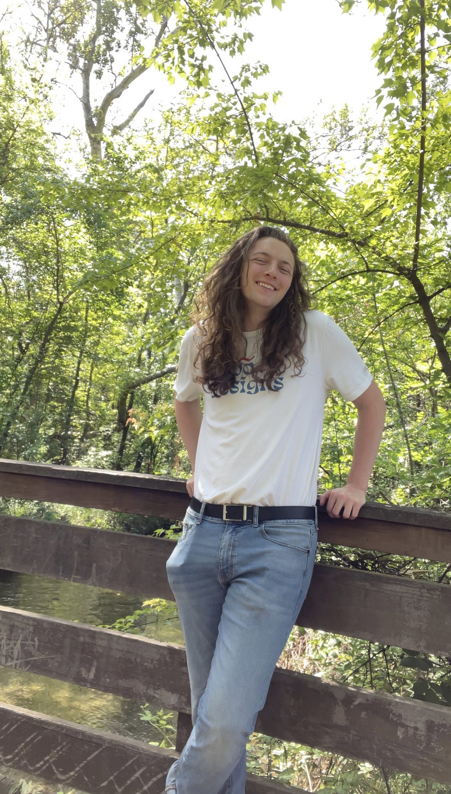

# UX Portfolio

Hi there! My name is Spencer Leff, and I am a computer science major enrolled in the Usability Engineering course at Chico State University. Usability is something I have always had an interest in, whether it be getting frustrated at a terribly designed microwave, using a controller to play video games, or even helping my Dad test his music-related IOS apps as a kid. Now, as someone pursuing a career path in software, usability will most likely be one of the vital aspects related to my future work!

## UX Journal
[Journal Entry 1](j01/)
[Journal Entry 2](j02/)
