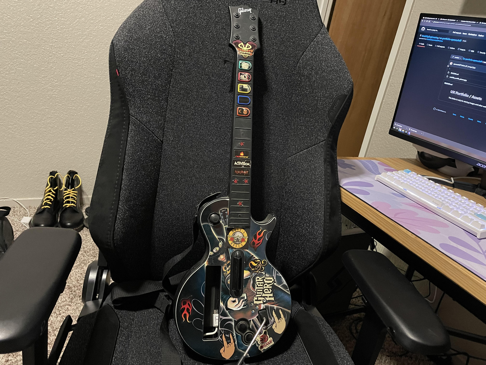

[Home](../)

## Guitar Hero Wii Controller - User eXperience
### By Spencer Leff - 2/23/22

The Guitar Hero Controller is the perfect example of how usability can take a great product to the next level. The easy-to-press buttons, auditory feedback, and engaging mechanics all assist in creating an appealing experience for the user as they go on their journey to become a rock star.

Guitar Hero is a music rhythm game first released in 2005 for the Playstation 2. The user utilizes a guitar-shaped controller (like the one pictured above) in order to "play" rock music by holding one of the five buttons on the neck that each correspond to a possible incoming note on the screen. As the note crosses the line pictured on screen, the player must strum the guitar at the same time, which makes a **satisfying** clicking sound that tells the user that they successfully played a note. 

This entire process of figuring out how to play the game is extremely **learnable**, and its mostly because of the self-explanatory nature of the guitar. By color coding the buttons with a **natural mapping** system, a user can almost instantly learn which button corresponds with the notes on screen. Timing the strums is slightly harder to learn, but the player is given assistance by the game itself, especially as a novice. You begin by playing very slow songs, using only three of the colored buttons, which allows the user to get more comfortable with the controller. As you gain more confidence, you can progress through the game to tougher and tougher songs.

The **safety** of the controller was also well designed.  The unit comes with a strap that goes across your entire body, and can be easily adjusted at any time.  Additionally, the slot in which the wii controller gets plugged into is very secure, and thus the wii remote (not pictured) won't ever fall out while playing the game.

Although the controller is designed very well, it is not perfect.  While attempting to tilt the guitar upwards to activate an in game mechanic named star power (increases the points gained per note), many users including myself find that the controller has trouble recognizing this motion and will thus not activate until the second, third, or even fourth attempt.  This can definitely lead to a decrease in **satisfaction** when it occurs, especially when it causes the user to miss a note or two during the song.  Compared to my old school model from the 2007 wii version, newer controllers from more recent Guitar Hero games face this problem much less as the technology has progressed.

Overall, the Guitar Hero controller provides a fun User eXperience that only builds upon an already enjoyable video game.
