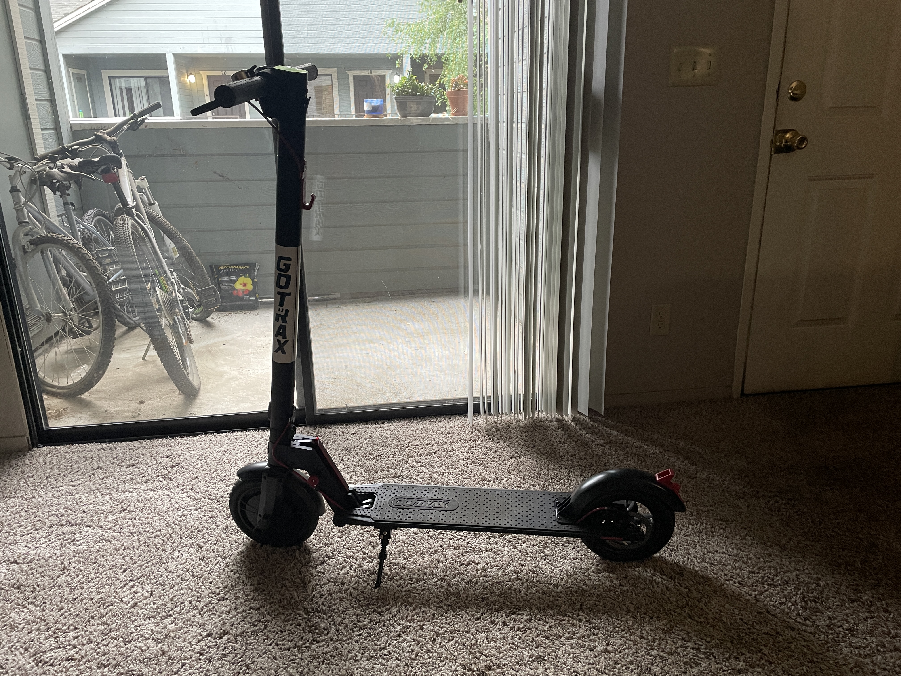
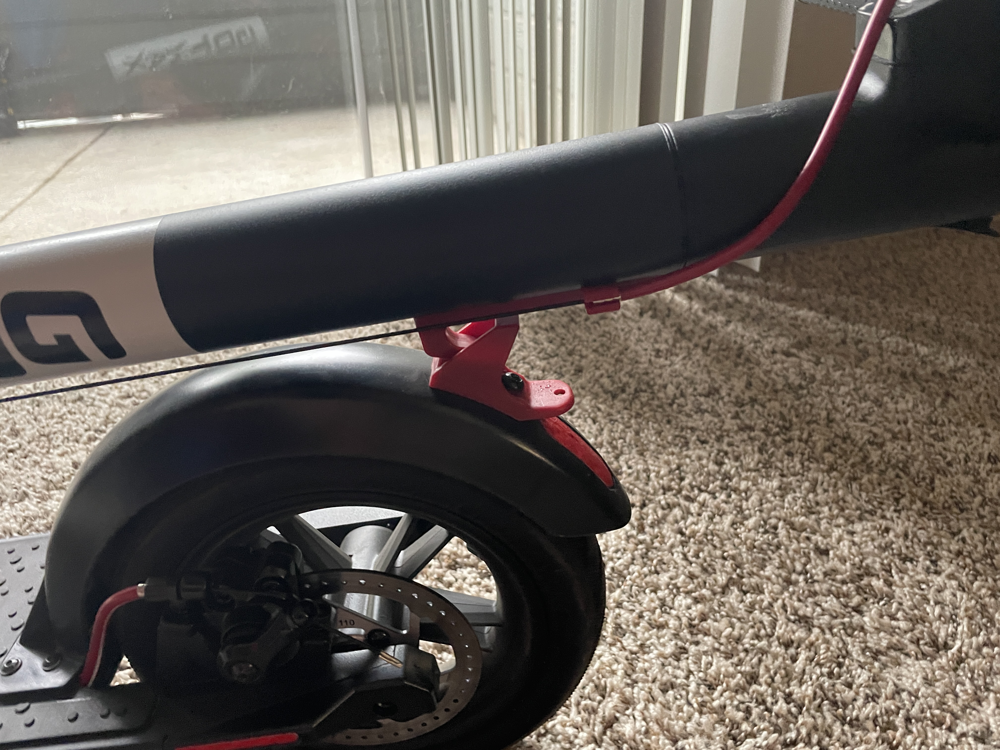
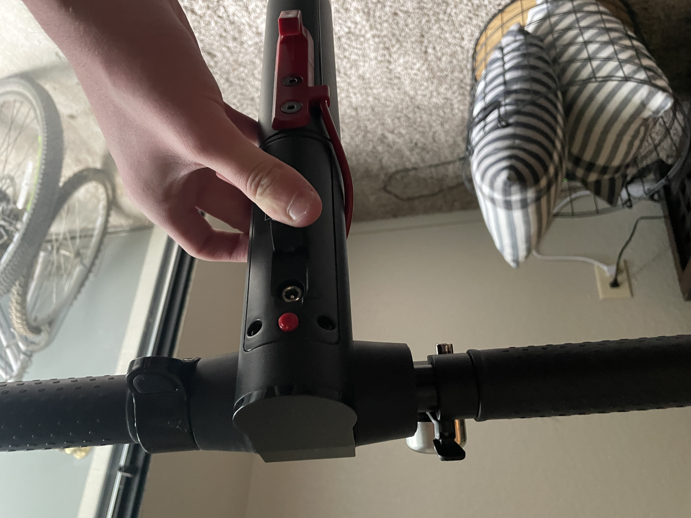

[Home](../)

## GOTRAX GXL V2 Electric Scooter - User eXperience
### By Spencer Leff - 4/14/22

The GOTRAX GXL V2 electric scooter provides a very enjoyable travel experience for a pretty reasonable price.  It is made with pretty solid materials at a $300 price point, and has a top speed of 15.5 mph. These two factors, along with its range of 12 miles on a full charge explains why it is by far the most popular choice when it comes to electric scooters.  However, there are some flaws in the scooter's design when discussing the user experience.

The first gripe I have with the design of the scooter is the folding mechanism. The process to fold the scooter after using it is nearly flawless. You simply pull a lever near the front of the device and to allow the upper portion of the scooter to begin folding downwards towards the back wheel.  Then, you line up the two red pieces and push them down onto one another until it clicks.  The entire process is simple to complete, and extremely **error tolerance**.  If the two latches are not lined up, you can easily adjust it and push again until it properly folds.  The real problem with this part of the scooter is unfolding it for use. This aspect of the scooter is **not easy to learn** by any means. After many uses of this scooter, I still struggle to pull apart these two red pieces. The idea is to push down on the back fender while also pulling up on the handlebar to separate the upper and lower red latches.  No matter how confident or strategic I am, I fail to separate these pieces at least two times before successfully pulling them apart.  Overall, this causes the unfolding process to be **unsatisfying** each and every time I use the device. 

Shown in the image above is the power button (red circular button), as well as the charging port, for which the cover is pulled back in this image.  The charging experience overall is well done.  The scooter can be charged at any working electrical outlet, which provides some versatility.  It can charge from 0 to full in about 3 hours, which is nothing to brag about but gets the job done.  The power button can be a little trickier.  A short press of the button activates the headlight on the front of the scooter.  Holding the power button for about 5 seconds turns the device on and off.  While in theory this system is fine, I find that it can be difficult to perform a long press. Oftentimes I don't press the button hard enough, and the headlight turns on halfway through my long press, canceling the action I wanted to perform.  So far, I've had a tough time **remembering (memorization)** to press hard enough to actually turn the device on or off like I want to, but it's so easy to fix that it doesn't reduce user **satisfaction**.

Finally, is the user interface when the scooter is turned on.  As shown on the screen, a user can easily glance down and view their current speed and battery life remaining. In order to accelerate, the user must first push the scooter until it is going about 3 MPH. Once this speed is achieved, you can press down on the button on the right side of the center console to move forward. Accelerating feels zippy, while also being quite **safe**.  The safety is enhanced by the braking system, in which a user intuitively pulls back on the bar that extends on the left side of the center console.  Accelerating and braking are smooth, but driving over rough patches, bumps, and cracks can be somewhat **dangerous** and create a bumpy ride.  A user should be aware of their surroundings and slow down before driving over any questionable areas.
