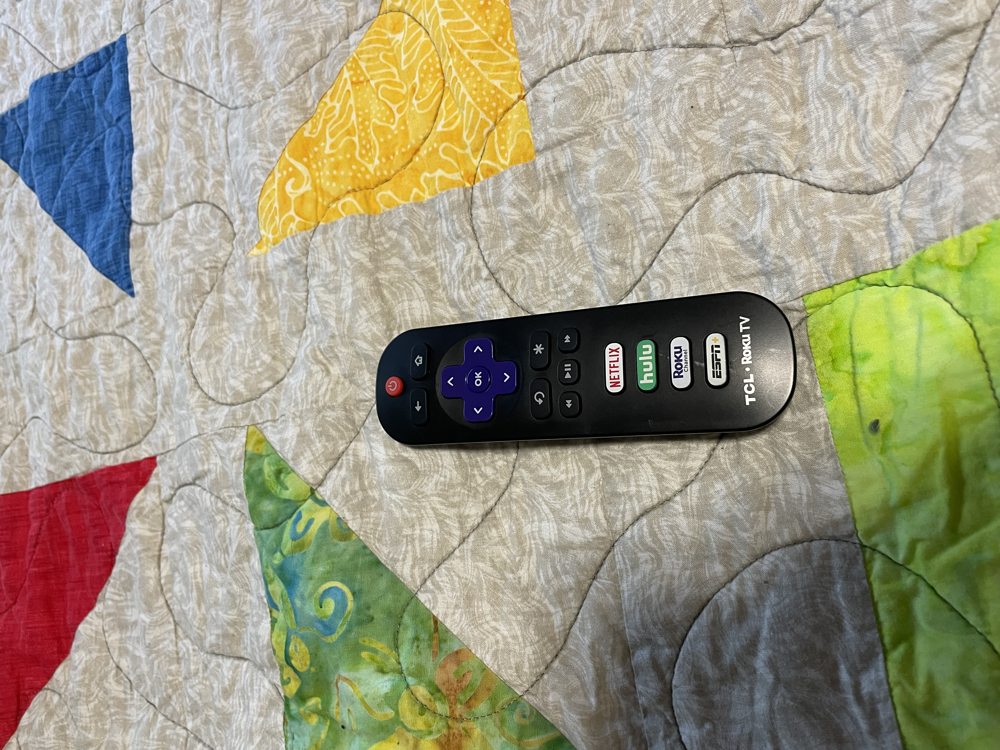
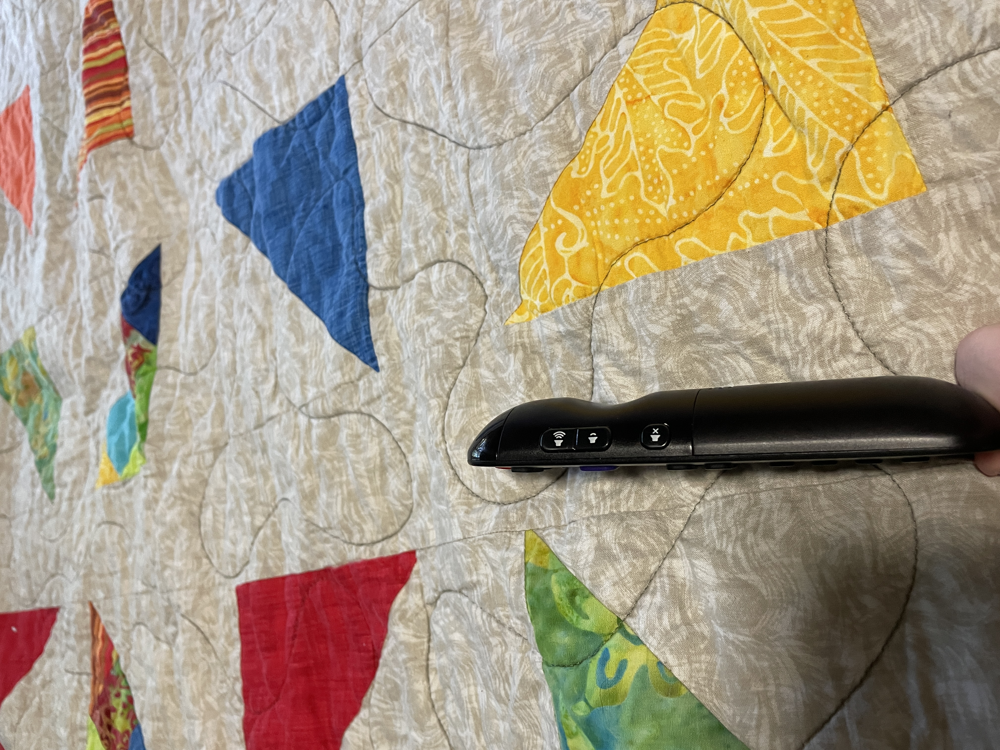
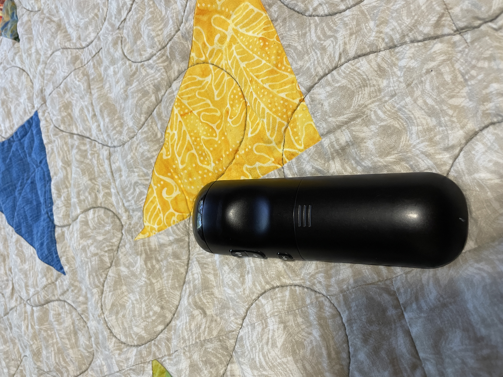

[Home](../)

## TCL Roku TV Remote - User eXperience
### By Spencer Leff - 5/13/22

The Roku TV Remote is a modern take on the typical television remote that is more in tune with the streaming service era. The TV itself fits nicely into the niche of an affordable 4k device to play video from any video application you can think of, whether it be Youtube, Netflix, Hulu, Prime Video, ESPN, Disney+, and many others. From the viewpoint of an individual who has never used this remote before, what immediately stands out is the purple arrows and ok button, which serve as the main controls, as well as the colorful buttons at the bottom which take you directly to the streaming service pictured on each of the buttons.  Each item on the device is clearly labeled, and there aren't so many buttons that the overall **learnability** is difficult in any way. The most trouble that I had, and what presumably any beginner will have issues with is the asterisk button located in the center black buttons. Although it is unclear what this may do at first, simply trying the button and seeing that it opens a settings menu is not detrimental to the **satisfaction** of the product. 

On the right side of the remote are three buttons that again follow **existing design conventions** very well. As everyone should be familiar with, there is a volume up button placed right above the volume down button. Then, after a small gap is the mute button. As is the case on the controls on the front of the remote, these are also easy to get down. After only a few uses, I had a good **mental map** of how the remote worked, and was able to successfully perform my desired actions without looking most of the time, displaying a good **memorization** level.

As shown in the image above, the backing of the remote has three vertical lines on it, which again follows **existing design conventions** that all indicate to place your finger on the lines and slide to open the panel.  This opens the back of remote in which batteries can be quickly replaced.  One issue that I've noticed after a few years of use is the huge difference in **efficiency** when the batteries are not brand new.  Even when the batteries are only about halfway used, actions can take up to a few seconds to register on the actual television, which can get frustrating after only a couple minutes of use.  Overall though, I believe that the Roku TV Remote does its job pretty well, and provides a familiar and comfortable experience for the user.
